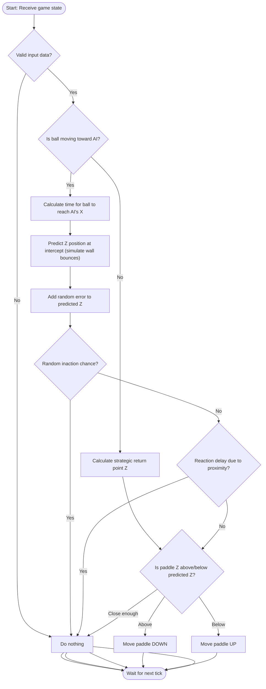

# AI Service for ft_transcendence Pong

## What is this service?
This service implements the AI opponent for the ft_transcendence Pong project. It runs as a separate microservice, connects to the backend via WebSocket, and plays as a real player in solo (PVC) mode.

## Why is this "AI"?
- The service **autonomously analyzes the game state** and makes decisions about how to move the paddle.
- It **predicts** where the ball will cross its side, simulating wall bounces, and moves accordingly.
- It acts only once per second, simulating human reaction time.
- It is not hardcoded for a single scenario: it adapts to any valid game state and can win or lose.
- It adds imperfections like prediction errors and reaction delays, making it feel more human and less robotic.

## How does the AI algorithm work?
The AI logic for the Pong 3D game has been enhanced to provide a more intelligent and human-like opponent for the Player vs Computer (PvC) mode. The algorithm, implemented in `src/ai-logic.ts`, is designed to simulate human behavior by incorporating predictive modeling, strategic positioning, and deliberate imperfections as required by the `ft_transcendence` subject (IV.5 AI-Algo). Below is a detailed explanation of how the AI operates.

### Input
The AI algorithm receives the following game state data to make decisions:
- **Paddle Position**: AI's current paddle position `[x, y, z]`
- **Ball Position**: Current ball position `[x, y, z]`
- **Ball Velocity**: Ball speed and direction vector (normal)
- **Game Physics**: Field dimensions and wall positions from `configuration.json`

### Algorithm Steps
The `getAIMove` function processes the game state and determines the AI's action through the following steps:
1. **Input Validation**: 
   - Checks for valid input data (paddle and ball coordinates, speed). If any data is invalid (e.g., null coordinates or negative speed), it returns 'none' to avoid erroneous moves.
2. **Ball Direction Analysis**:
   - Determines whether the ball is moving towards or away from the AI paddle by checking the AI's position (left or right side) and the ball's horizontal direction (normal[0]). This decides whether to defend or reposition strategically.
3. **Strategic Positioning (Ball Moving Away)**:
   - If the ball is moving away, the AI calculates a strategic return point. It predicts where the ball might return after reaching the opponent's side by estimating the time to reach the opponent's side and adjusting for bounces off the field boundaries. This simulates anticipation, moving the paddle towards this predicted Z position.
4. **Ball Trajectory Prediction (Ball Moving Towards)**:
   - If the ball is moving towards the AI, it calculates the time for the ball to reach the paddle's X position using the ball's horizontal velocity.
   - Predicts the ball's Z position at that time, accounting for bounces off the top and bottom walls to ensure realistic prediction within the game environment.
5. **Human-like Imperfections**:
   - **Prediction Error**: Adds a random error (±3 units) to the predicted Z position to simulate imperfect human prediction, making the AI less precise.
   - **Random Inaction**: Introduces a chance (20% if ball is far, 10% if close) for the AI to do nothing, mimicking human hesitation, especially when the ball is at a distance.
   - **Reaction Delay**: When the ball is very close (<5 units), there's an increased chance (20% base plus speed adjustment) for the AI to delay reaction, simulating human reflex limitations.
6. **Dynamic Movement Decision**:
   - Compares the predicted ball Z position with the current paddle Z position using a dynamic threshold (based on ball speed) to decide whether to move 'up', 'down', or stay 'none'. This threshold adjusts for faster balls, requiring more urgent movement.
   - Includes special logic to force movement if the paddle is stuck at Z=0 (center) and the ball is approaching, preventing static behavior in critical situations.
7. **Output**:
   - Returns one of three actions: 'up', 'down', or 'none', which are translated into paddle movements sent via WebSocket to the game service, simulating keyboard input as per the subject requirements.

### Key Features
- **Physics-based Prediction**: Uses real game physics to predict ball trajectory, including speed and direction.
- **Wall-aware**: Simulates ball bounces off walls for accurate trajectory calculation.
- **Adaptive Behavior**: Adjusts movement urgency based on ball speed with a dynamic threshold.
- **Human-like Imperfections**: Incorporates prediction errors, random inaction, and reaction delays to avoid perfect play and mimic human limitations.
- **Strategic Thinking**: Positions paddle strategically when the ball is moving away, anticipating the ball's return.
- **Efficient Processing**: Calculates moves only when necessary (e.g., ball approaching), optimizing performance within the 1-second update constraint.

## Flowchart of the AI Logic

## How to test the AI logic in isolation
1. Run `npx ts-node test-ai.ts` in the `ai-service` directory.
2. The script will print the AI's move for a variety of scenarios.
3. You can add more test cases in `test-ai.ts` to cover additional situations.

## How to run the service in the full system
1. Make sure all dependencies are installed: `npm install`
2. Start the full system with Docker Compose: `docker-compose up --build`
3. The AI service will connect to the backend and play as the AI opponent in solo mode.

## Requirements
- Node.js and npm
- TypeScript
- ws (WebSocket library)
- ts-node (for running TypeScript directly)

# CURL Commands to test ai-service:

curl -X POST http://localhost:8086/join-game/abc123

curl -X POST http://localhost:8082/matchmaking \
  -H "Content-Type: application/json" \
  -d '{"mode": "pvc"}'

## How to test the AI logic in isolation
1. Run `npx ts-node test-ai.ts` in the `ai-service` directory.
2. The script will print the AI's move for a variety of scenarios.
3. You can add more test cases in `test-ai.ts` to cover additional situations.

## How to run the service in the full system
1. Make sure all dependencies are installed: `npm install`
2. Start the full system with Docker Compose: `docker-compose up --build`
3. The AI service will connect to the backend and play as the AI opponent in solo mode.

# To check if AI joined the game
curl http://localhost:8086/sessions

## To monitor the logs
docker-compose logs -f ai-service backend game-service

