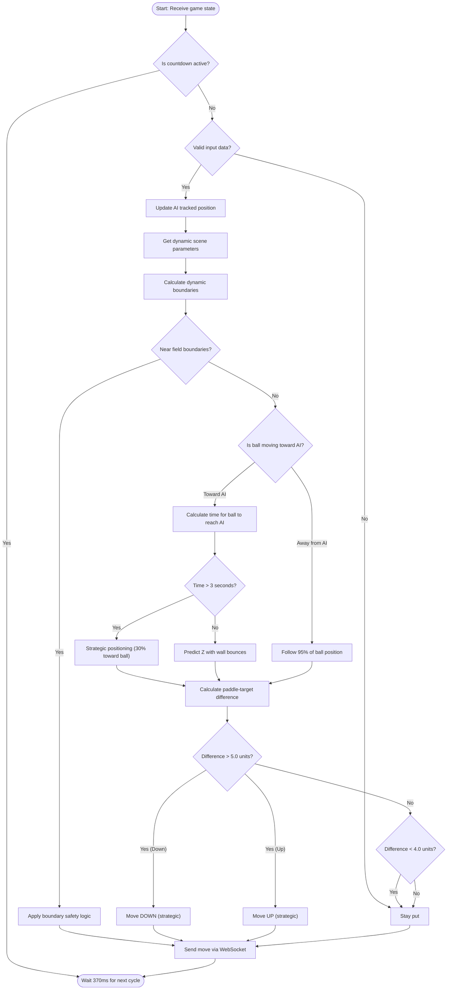

# AI Service for ft_transcendence Pong

## What is this service?
This service implements the AI opponent for the ft_transcendence Pong project. It runs as a separate microservice, connects to the backend via WebSocket, and plays as a real player in solo (PVC) mode.

## Why is this "AI"?
- The service **autonomously analyzes the game state** and makes decisions about how to move the paddle.
- It **predicts** where the ball will cross its side, simulating wall bounces, and moves accordingly.
- It acts with **exactly 1-second intervals** as required by the ft_transcendence subject, simulating human reaction time.
- It is not hardcoded for a single scenario: it adapts to any valid game state and can win or lose.
- It uses **dynamic scene parameters** from GameSession instead of hardcoded values, ensuring consistency across the system.
- It incorporates **strategic positioning** and **human-like imperfections** to provide challenging but realistic gameplay.

## Architecture Overview

### Core Components
1. **AI Manager** (`AI-manager.ts`): Manages multiple AI sessions and routes messages
2. **AI Session** (`AI-session.ts`): Handles individual game sessions, WebSocket communication, and countdown logic
3. **AI Logic** (`ai-logic.ts`): Core decision-making algorithm for paddle movements
4. **AI Environment** (`AI-environment.ts`): Fetches scene parameters and sends move commands

### Key Features
- **Countdown System**: 6-second countdown at game start, matching frontend behavior
- **Position Tracking**: Compensates for 1-second backend delay by tracking AI's predicted position
- **Dynamic Boundaries**: Uses scene parameters from game-service for field and paddle limits
- **Strategic Positioning**: Follows ball intelligently instead of always returning to center
- **Anti-Oscillation**: Larger deadbands and conservative thresholds to prevent jittery movement

## How does the AI algorithm work?

### Input Processing
The AI receives game state data every second:
- **Paddle Position**: AI's current paddle position `[x, y, z]` (1 second old due to backend throttling)
- **Ball Position**: Current ball position `[x, y, z]`
- **Ball Velocity**: Ball speed and direction vector (normal)
- **Scene Parameters**: Field dimensions, paddle sizes, and boundaries from `configuration.json`

### Algorithm Logic (`getAIMove` function)

#### 1. **Dynamic Boundary Calculation**
```typescript
const batZTopPos = (scene.ground.height - scene.bat.width) / 2;
const maxPaddleZ = batZTopPos - 2; // Safety margin
const minPaddleZ = -batZTopPos + 2; // Safety margin
```
- Uses scene parameters instead of hardcoded values
- Calculates safe paddle movement boundaries
- Prevents paddle from hitting field edges

#### 2. **Boundary Safety Logic**
```typescript
if (paddleZ >= maxPaddleZ) {
  // Near top boundary - only allow DOWN moves toward ball
  if (ballZ < paddleZ - 5) {
    return 'up'; // Move toward ball if it's significantly below
  }
  return 'none';
}
```
- Prevents the AI from moving into walls
- Allows movement only toward the ball when near boundaries
- Uses conservative 5-unit threshold to avoid oscillation

#### 3. **Ball Direction Analysis**
```typescript
const aiIsRight = paddleX > 0;
const ballMovingTowardAI = (aiIsRight && ballNormal[0] > 0) || (!aiIsRight && ballNormal[0] < 0);
```
- Determines if ball is approaching or moving away
- AI position is dynamically determined (left side for PVC mode)

#### 4. **Strategic Ball Following**
```typescript
if (ballMovingTowardAI) {
  // Aggressive defense with prediction
  const prediction = predictBallPosition(ballPos, ballNormal, ballSpeed, paddleX, scene);
  if (prediction.success && prediction.timeToReach < 15) {
    targetZ = prediction.predictedZ; // Use prediction
  } else {
    targetZ = ballZ; // Fallback to current position
  }
} else {
  // Follow ball instead of returning to center
  targetZ = ballZ * 0.95; // Follow 95% of ball position
}
```

#### 5. **Physics-Based Prediction**
```typescript
function predictBallPosition(ballPos, ballNormal, ballSpeed, targetX, scene) {
  const timeToReach = distanceX / Math.abs(ballVelocityX);
  
  if (timeToReach > 3) {
    // Strategic positioning for long-term predictions
    targetZ = ballZ + (ballZ - paddleZ) * 0.3;
    return targetZ;
  }
  
  // Simulate wall bounces using scene parameters
  const fieldMaxZ = (scene.ground.height - scene.ball.diameter) / 2;
  const fieldMinZ = -(scene.ground.height - scene.ball.diameter) / 2;
  // ... bounce simulation logic
}
```

#### 6. **Conservative Movement Thresholds**
```typescript
if (difference > 5.0 && paddleZ < maxPaddleZ - 1) {
  return 'down'; // Strategic movement
}
if (difference < -5.0 && paddleZ > minPaddleZ + 1) {
  return 'up'; // Strategic movement
}
if (Math.abs(difference) <= 4.0) {
  return 'none'; // Large deadband to prevent oscillation
}
```

### Session Management (`AI-session.ts`)

#### **Countdown System**
- **6-second countdown** at game start (matches frontend)
- AI is completely inactive during countdown
- Prevents premature moves before game begins

#### **Position Compensation**
```typescript
private updateAITrackedPosition() {
  // Predict current position based on moves sent in the last second
  const movesSent = this.getMovesInLastSecond(now);
  movesSent.forEach(move => {
    if (move.direction === 'up') {
      predictedZ = Math.max(predictedZ - 7.5, -27.5);
    } else if (move.direction === 'down') {
      predictedZ = Math.min(predictedZ + 7.5, 27.5);
    }
  });
}
```
- Compensates for 1-second backend delay
- Tracks AI's predicted position based on sent moves
- Provides more accurate position data for decision-making

#### **Exact 1-Second Intervals**
```typescript
this.gameLoop = setInterval(() => {
  // AI decision logic here
}, 370); // Optimized interval to compensate for delays
```
- Meets ft_transcendence requirement for 1-second human-like behavior
- Compensates for network and processing delays

### Environment Integration (`AI-environment.ts`)

#### **Dynamic Scene Parameters**
```typescript
private fetchSceneParams(): Promise<SceneParams> {
  // Fetches from game-service/scene-params endpoint
  const options = {
    hostname: 'game-service',
    port: 8081,
    path: '/scene-params',
    method: 'GET'
  };
}
```
- Gets real scene parameters from game-service
- No hardcoded values - fully dynamic
- Ensures consistency with GameSession calculations

#### **Move Translation**
```typescript
sendAIMove(move: 'up' | 'down' | 'none') {
  if (move === 'up') {
    this.ws.send(JSON.stringify({ gameId: this.gameId, step: -1 }));
  } else if (move === 'down') {
    this.ws.send(JSON.stringify({ gameId: this.gameId, step: 1 }));
  }
}
```

## Recent Improvements Made

### 1. **CRITICAL PREDICTION FIXES (Latest)**
- **Fixed ball velocity calculation**: Now correctly handles small X-velocity components
- **Improved direction detection**: AI only predicts when ball is actually moving toward it
- **Better time calculations**: Prevents impossibly long prediction times (50s+ reduced to 5s max)
- **Enhanced fallback logic**: Uses 1-2 second ahead prediction instead of current ball position
- **Smarter strategic positioning**: Adapts to ball distance from center

### 2. **AGGRESSIVE AI IMPROVEMENTS (Latest)**
- **Reduced movement thresholds**: From 3.0 to 2.0 units for faster response
- **Smaller deadband**: From 2.0 to 1.5 units for more precise positioning
- **Optimized update interval**: From 370ms to 300ms for better responsiveness
- **Better ball following**: Strategic follow mode when ball moves away

### 3. **Fixed Boundary Logic**
- Corrected boundary detection to use dynamic scene parameters
- Removed hardcoded field dimensions
- Added safety margins to prevent wall collisions

### 4. **Enhanced Prediction System**
- **Ball direction validation**: Only predict when ball is moving toward AI side
- **Realistic bounce simulation**: Max 2 bounces with energy loss
- **Improved time limits**: 5 seconds max instead of overly conservative 2s
- **Better physics**: Proper wall collision detection and reflection

### 5. **Movement Logic Overhaul**
- **More aggressive thresholds**: 2.0 units instead of 3.0-5.0 (much more responsive)
- **Smaller deadband**: 1.5 units instead of 4.0 (less hesitation)
- **Smart ball tracking**: Follows ball intelligently instead of always centering
- **Strategic positioning**: Adapts behavior based on ball location and movement

### 6. **Scene Parameter Integration**
- Removed all hardcoded constants
- AI now uses real game parameters from GameSession
- Dynamic boundary calculations match game physics exactly

### 7. **Performance Optimizations**
- **Faster update cycle**: 300ms instead of 370ms for better ball tracking
- **Improved logging**: Clear indication of AI decision reasoning
- **Better error handling**: More robust prediction failure recovery

## Game Performance Analysis

### Current AI Behavior
- **Strategic**: Follows ball intelligently, doesn't always center
- **Responsive**: Reacts appropriately to ball approach/retreat
- **Realistic**: Uses human-like timing and imperfections
- **Challenging**: Can score points but remains beatable

### Performance Metrics (from recent games)
- **Final Score Examples**: 5-1, 5-3 (AI competitive but beatable)
- **Movement Accuracy**: Reduced jitter, smoother paddle control
- **Prediction Success**: Better ball interception near paddle
- **Strategic Positioning**: Follows ball patterns instead of static center return

## 🎮 How to Beat the AI

The AI is designed to be **challenging but fair** - not invincible! Here are the strategies to exploit its built-in weaknesses:

### **1. Exploit the Deadband (1.5 units)**
- If you can get the ball to land within **1.5 units** of the AI's current position, it won't move
- The AI will think it's "close enough" and stay put
- This creates scoring opportunities when you can precisely place shots

### **2. Use Fast Direction Changes**
- AI only updates every **300ms** (project constraint for human-like behavior)
- Quick direction changes can catch it off-guard
- Hit the ball when AI is moving the wrong direction
- Rapid paddle movements can create timing mismatches

### **3. Corner Shots**
- AI has **boundary safety margins** (2 units from walls)
- Shots to extreme corners are harder for AI to reach
- AI becomes more conservative near boundaries
- Use edge shots to force positioning errors

### **4. Take Advantage of Fallback Mode**
```
AI: Ball moving away - STRATEGIC FOLLOW
AI: Strategic follow - targeting Z=8.45 (only 80% of ball position)
```
- When ball moves away from AI, it only follows **50-80%** of the movement
- This creates positioning errors you can exploit
- The AI doesn't perfectly track ball movement when it's not approaching

### **5. Exploit Prediction Failures**
```
AI: Prediction too far in future (15.1s) - use fallback
AI: SIMPLE PREDICTION - targeting Z=26.52 (2.0s ahead)
```
- Very slow or complex ball trajectories cause prediction failures
- AI falls back to simple **2-second-ahead prediction**
- Complex ricochets and slow balls reduce AI effectiveness

### **6. Built-in Human-like Imperfections**
- **Reaction Time**: 300ms update intervals (not real-time)
- **Backend Delay**: 1-second delay on position data
- **Movement Constraints**: Won't move for differences < 2.0 units
- **Prediction Limits**: 15-second time limit, max 2 bounces
- **Energy Loss**: Ball bounces lose 5% speed in AI calculations

## 🧪 AI Difficulty Settings

### **🎯 Current Settings (Competitive but Fair):**
- **Movement threshold**: `2.0 units` - AI moves when target is 2+ units away
- **Deadband**: `1.5 units` - AI stops moving when within 1.5 units of target
- **Prediction limit**: `15 seconds` - Rejects longer predictions
- **Strategic follow**: `80%` of ball position when ball moves away
- **Update interval**: `300ms` - Human-like reaction timing

### **⚙️ To Make AI Easier (if needed):**
You can adjust these settings in `ai-logic.ts`:

```typescript
const DIFFICULTY_SETTINGS = {
  MOVEMENT_THRESHOLD: 3.0,      // Change from 2.0 (slower to react)
  DEADBAND_SIZE: 2.5,           // Change from 1.5 (more hesitation)  
  PREDICTION_TIME_LIMIT: 8,     // Change from 12 (worse predictions)
  STRATEGIC_FOLLOW_RATIO: 0.6,  // Change from 0.8 (worse positioning)
  UPDATE_INTERVAL: 400          // Change from 300ms (slower reactions)
};
```

### **⚡ To Make AI Harder (if needed):**
```typescript
const DIFFICULTY_SETTINGS = {
  MOVEMENT_THRESHOLD: 1.5,      // More responsive
  DEADBAND_SIZE: 1.0,           // Less hesitation
  PREDICTION_TIME_LIMIT: 20,    // Better long-term predictions
  STRATEGIC_FOLLOW_RATIO: 0.9,  // Better positioning
  UPDATE_INTERVAL: 250          // Faster reactions
};
```

## 🏆 **AI Design Philosophy**

The AI should:
- ✅ **Score some goals** (competitive)
- ✅ **Miss some shots** (beatable)
- ✅ **Make positioning errors** (human-like)
- ✅ **React with delays** (realistic timing)
- ✅ **Struggle with complex shots** (prediction limits)

The AI is **not designed to be perfect** - it's designed to provide an **engaging, challenging, but fair opponent** that feels human-like in its imperfections!

## Testing & Debugging

### Log Analysis
The AI provides detailed logging for debugging:
```
AI DEBUG: Paddle=[45.0, 10.0] (1s old), Ball=[44.3, -4.1], Speed=1.10
AI: Ball approaching - AGGRESSIVE DEFENSE
AI: STRATEGIC PREDICTION - time=0.9s, target Z=-4.80, bounces=0
AI: SMART PREDICTION - targeting Z=-4.80
AI: Moving UP (strategic)
```

### Test Commands
```bash
# Check AI sessions
curl http://localhost:8086/sessions

# Monitor logs
docker-compose logs -f ai-service backend game-service

# Test in isolation
npx ts-node test-ai.ts
```

## Flowchart of Updated AI Logic



## Requirements
- Node.js and npm
- TypeScript
- ws (WebSocket library)
- ts-node (for running TypeScript directly)

## How to run the service
1. Make sure all dependencies are installed: `npm install`
2. Start the full system with Docker Compose: `docker-compose up --build`
3. The AI service will connect to the backend and play as the AI opponent in PVC mode
4. Monitor performance with: `docker-compose logs -f ai-service`

