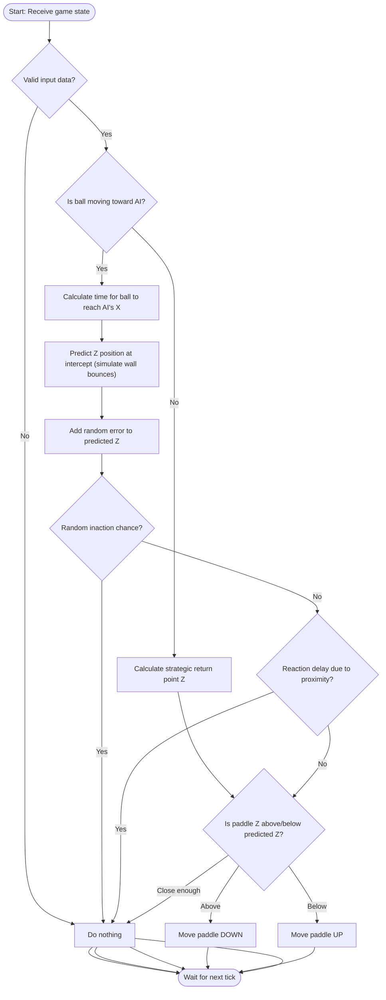

# 🤖 AI Service Current Integration - Documentation for Tatiana

## Overview

This document explains how the AI service is (currently) integrated into the ft_transcendence Pong game system.

The AI acts as a **special player** that can play against human users in PVC (Player vs Computer) mode.

## 🏗️ Architecture Overview

```
Frontend → Backend → Game-service → Backend → AI-service
    ↓         ↓           ↓           ↓         ↓
   User    Gateway    Physics    Coordinator  AI Brain
```

The AI is treated as a **special case player** with ID `-1` throughout the entire system.

## 🔄 Complete Integration Flow

### Step 1: User Initiates PVC Game
```typescript
// Frontend sends WebSocket message to backend
{ mode: 'pvc' }
```

### Step 2: Backend Routes to Game Service
```typescript
// backend/src/index.ts lines 108-113
const mode = msg.mode as GAME_MODE; // 'pvc'
const data = await users.matchmaking(user_id, socket, mode);
// Calls: post_matchmaking__game_service(user_id, 'pvc')
```

### Step 3: Game Service Creates PVC Game
```typescript
// game-service/src/index.ts lines 69-75
case GAME_MODE.PVC:
    const aiOpponentId = -1; // ⭐ AI gets special ID
    const pvcGame = gameSessionFactory.createSession(socket_id, aiOpponentId, mode);
    reply.send({
        gameId: pvcGame.getId(),
        users: [socket_id, aiOpponentId] // [human_id, -1]
    });
    gameSessionFactory.startGameLoop(pvcGame.getId());
```

### Step 4: Backend Processes Game Creation
```typescript
// backend/src/index.ts lines 115-135
if ('gameId' in json) {
    const gameUsers: number[] = json.users; // [human_id, -1]

    gameUsers.forEach((gameSocketId, id) => {
        // ⭐ CRITICAL: Skip AI for socket operations
        if (gameSocketId !== -1) {
            // Only send game info to human player
            const reply = { gameId: json.gameId, order: id, opponent: 'AI' };
            users.setPlayingStateToUser(gameSocketId);
            users.getGameSocketById(gameSocketId)?.forEach(socket =>
                socket.send(JSON.stringify(reply))
            );
        }
    });
}
```

### Step 5: Backend Triggers AI Service
```typescript
// backend/src/index.ts lines 136-142
if ('gameId' in json && mode === GAME_MODE.PVC) {
    // ⭐ AUTOMATIC AI CONNECTION
    fetch('http://ai-service:8086/join-game/' + json.gameId, {
        method: 'POST'
    }).catch(err => console.log('AI service unavailable:', err));
}
```

### Step 6: AI Service Receives Join Request
```typescript
// ai-service/src/index.ts lines 43-52
fastify.post('/join-game/:gameId', async (request, reply) => {
    const { gameId } = request.params;
    // Creates new WebSocket connection to backend
    manager.createSession(BACKEND_WS_URL, aiToken);
    return { status: 'joined', gameId };
});
```

### Step 7: AI Connects with Special Authentication
```typescript
// ai-service/src/AI-session.ts constructor
constructor(gameId: string, backendUrl: string, token: string) {
    // Connect with special AI token
    this.ws = new WebSocket(backendUrl, ['AI_SERVICE_TOKEN']);

    this.ws.on('open', () => {
        // Tell backend we're ready to play
        this.ws.send(JSON.stringify({ mode: 'pvc', gameId }));
    });
}
```

### Step 8: Backend Recognizes AI Connection
```typescript
// backend/src/index.ts lines 67-85
if (token === 'AI_SERVICE_TOKEN') {
    socket.id = -1; // ⭐ AI gets special player ID
    aiSocket = socket; // ⭐ Store global AI reference
    console.log("AI service connected");

    socket.on('message', async message => {
        // Forward AI moves to game-service
        if ('gameId' in msg && 'step' in msg) {
            post_bat_move__game_service(gameId, -1, step);
        }
    });

    return; // ⭐ Skip normal user authentication
}
```

### Step 9: Game Loop - AI Receives Game State
```typescript
// backend/src/index.ts lines 23-38
Fastify.post('/game/:gameId', (request, reply) => {
    const { players } = request.body; // [human_id, -1]

    // Send to human players
    const humanPlayers = players.filter(p => p !== -1);
    humanPlayers.forEach(player => {
        const sockets = users.getGameSocketById(player);
        sockets?.forEach(socket => socket.send(JSON.stringify(request.body)));
    });

    // ⭐ Send to AI via special global reference
    if (players.includes(-1) && aiSocket) {
        aiSocket.send(JSON.stringify(request.body));
    }
});
```

### Step 10: AI Processes and Responds
```typescript
// ai-service/src/AI-session.ts
this.ws.on('message', (data) => {
    const msg = JSON.parse(data.toString());

    if (msg.players && (msg.pos || msg.ball)) {
        this.state = msg; // Store game state
        this.order = 1;   // AI is always right side (order 1)
    }
});

// Every second, calculate and send moves
setInterval(() => {
    if (this.state) {
        const aiState = this.transformGameState(this.state, this.order);
        const move = getAIMove(aiState); // 🧠 AI prediction algorithm
        if (move !== 'none') {
            this.ws.send(JSON.stringify({
                gameId: this.gameId,
                step: move
            }));
        }
    }
}, 1000);
```

### Step 11: Game End - AI in Scoring
```typescript
// backend/src/index.ts lines 39-49
if ("gameResult" in request.body) {
    const data: ScoreRequestBody = {
        first_user_id: players[0],
        second_user_id: players[1],
        first_user_name: users.getUserNameById(players[0]), // Returns 'AI' for -1
        second_user_name: users.getUserNameById(players[1]),
        score: score,
        game_mode: players.includes(-1) ? 'pvc' : 'pvp' // ⭐ Auto-detects PVC
    };
    post_score_data(data);
}
```

## 🎯 Special Case Handling

### 1. AI Authentication & Identity
- **Token**: `'AI_SERVICE_TOKEN'` bypasses normal user authentication
- **Player ID**: AI always gets ID `-1`
- **Storage**: AI socket stored in global `aiSocket` variable (not in user management)

### 2. User Management Special Cases
```typescript
// backend/src/Users.ts lines 87-91
getUserNameById(user_id: number) {
    if (user_id === -1) return 'AI'; // ⭐ Special case for AI
    return (this.idToUsers.get(user_id));
}
```

### 3. Game State Broadcasting
- **Human Players**: Via normal user socket management system
- **AI Player**: Via global `aiSocket` reference (bypasses user system)

### 4. Move Processing
Both human and AI moves use the same endpoint:
```typescript
// Same function for both!
post_bat_move__game_service(gameId, user_id, step);
// Human: post_bat_move__game_service(gameId, 123, step)
// AI:    post_bat_move__game_service(gameId, -1, step)
```

### 5. Game Mode Detection
```typescript
// Automatic detection throughout system
game_mode: players.includes(-1) ? 'pvc' : 'pvp'
```

## 🧠 AI Algorithm

The AI uses for now the following prediction algorithm:


### Input
The AI algorithm receives the following game state data to make decisions:
- **Paddle Position**: AI's current paddle position `[x, y, z]`
- **Ball Position**: Current ball position `[x, y, z]`
- **Ball Velocity**: Ball speed and direction vector (normal)
- **Game Physics**: Field dimensions and wall positions from `configuration.json`

### Algorithm Steps
The `getAIMove` function processes the game state and determines the AI's action through the following steps:
1. **Input Validation**:
   - Checks for valid input data (paddle and ball coordinates, speed). If any data is invalid (e.g., null coordinates or negative speed), it returns 'none' to avoid erroneous moves.
2. **Ball Direction Analysis**:
   - Determines whether the ball is moving towards or away from the AI paddle by checking the AI's position (left or right side) and the ball's horizontal direction (normal[0]). This decides whether to defend or reposition strategically.
3. **Strategic Positioning (Ball Moving Away)**:
   - If the ball is moving away, the AI calculates a strategic return point. It predicts where the ball might return after reaching the opponent's side by estimating the time to reach the opponent's side and adjusting for bounces off the field boundaries. This simulates anticipation, moving the paddle towards this predicted Z position.
4. **Ball Trajectory Prediction (Ball Moving Towards)**:
   - If the ball is moving towards the AI, it calculates the time for the ball to reach the paddle's X position using the ball's horizontal velocity.
   - Predicts the ball's Z position at that time, accounting for bounces off the top and bottom walls to ensure realistic prediction within the game environment.
5. **Human-like Imperfections**:
   - **Prediction Error**: Adds a random error (±3 units) to the predicted Z position to simulate imperfect human prediction, making the AI less precise.
   - **Random Inaction**: Introduces a chance (20% if ball is far, 10% if close) for the AI to do nothing, mimicking human hesitation, especially when the ball is at a distance.
   - **Reaction Delay**: When the ball is very close (<5 units), there's an increased chance (20% base plus speed adjustment) for the AI to delay reaction, simulating human reflex limitations.
6. **Dynamic Movement Decision**:
   - Compares the predicted ball Z position with the current paddle Z position using a dynamic threshold (based on ball speed) to decide whether to move 'up', 'down', or stay 'none'. This threshold adjusts for faster balls, requiring more urgent movement.
   - Includes special logic to force movement if the paddle is stuck at Z=0 (center) and the ball is approaching, preventing static behavior in critical situations.
7. **Output**:
   - Returns one of three actions: 'up', 'down', or 'none', which are translated into paddle movements sent via WebSocket to the game service, simulating keyboard input as per the subject requirements.

### Key Features
- **Physics-based Prediction**: Uses real game physics to predict ball trajectory, including speed and direction.
- **Wall-aware**: Simulates ball bounces off walls for accurate trajectory calculation.
- **Adaptive Behavior**: Adjusts movement urgency based on ball speed with a dynamic threshold.
- **Human-like Imperfections**: Incorporates prediction errors, random inaction, and reaction delays to avoid perfect play and mimic human limitations.
- **Strategic Thinking**: Positions paddle strategically when the ball is moving away, anticipating the ball's return.
- **Efficient Processing**: Calculates moves only when necessary (e.g., ball approaching), optimizing performance within the 1-second update constraint.

### Flowchart of the AI Logic



### Compliance with Subject Requirements
As outlined in the `ft_transcendence` subject (IV.5 AI-Algo), the AI must simulate a human player, update once per second, and avoid using the A* algorithm. This implementation meets these criteria:
- **Human Simulation**: Incorporates imperfections like prediction errors and reaction delays to mimic human behavior.
- **Update Frequency**: Invoked once per second during active gameplay (managed by `AISession` in `src/AI-session.ts`).
- **No A* Algorithm**: Relies on physics-based predictions and heuristic rules, not pathfinding algorithms.
- **Simulated Keyboard Input**: Sends discrete moves ('up', 'down', 'none') via WebSocket, mimicking keyboard input.

## Why This Qualifies as AI

As per the `ft_transcendence` subject requirements (IV.5 AI-Algo), the AI opponent must simulate a human player with intelligent behavior, update once per second, and avoid using the A* algorithm. Here's how our implementation meets these criteria and qualifies as AI:

- **Simulation of Human Behavior**:
  - The algorithm incorporates human-like imperfections such as prediction errors, random inaction, and reaction delays. These features prevent the AI from being overly perfect or robotic, mimicking human reaction times and decision-making flaws.

- **Intelligent Decision-Making**:
  - The AI uses predictive modeling to calculate ball trajectory, including bounces, which demonstrates foresight and planning. It doesn't merely react to the current ball position but anticipates future positions.
  - Strategic positioning when the ball is moving away shows tactical thinking, as the AI prepares for the ball's return rather than remaining idle.

- **Adaptability**:
  - The dynamic threshold for movement adjusts based on ball speed, allowing the AI to respond more urgently to faster balls, simulating adaptive behavior to varying game conditions.

- **Subject Compliance**:
  - **No A* Algorithm**: The algorithm does not use A* or any pathfinding algorithm. Instead, it relies on physics-based predictions and heuristic rules for decision-making.
  - **Update Frequency**: The AI logic is invoked once per second during active gameplay (as managed by `AISession` in `src/AI-session.ts`), aligning with the subject's requirement for periodic updates.
  - **Simulated Keyboard Input**: The AI sends discrete moves ('up', 'down', 'none') via WebSocket, mimicking keyboard input as if a human player were controlling the paddle.

## Balancing and Difficulty
- The AI's strength is balanced to avoid being unbeatable. Parameters like inaction chance (10-20%), prediction error (±3 units), and reaction delay (20% base) are tuned to make the AI challenging yet fair. These values can be adjusted further to modify difficulty without changing the core logic.
- Recent updates have increased these imperfection factors to reduce the AI's dominance, ensuring a more enjoyable experience for human players.

## Logging and Debugging
- Extensive logging is implemented to track AI decisions (e.g., predicted positions, movement choices, inaction triggers). This aids in debugging and evaluating the AI's behavior for further refinement.

## Future Improvements
- **Difficulty Levels**: While not currently implemented, the algorithm can be extended to support difficulty levels by adjusting parameters like inaction chance, error magnitude, and reaction delay.
- **Learning from Play**: Future iterations could incorporate basic learning mechanisms (e.g., adjusting strategies based on player patterns) to enhance adaptability, though constrained by the subject's simplicity requirements.
- **Complex Move Evaluation**: Inspired by alternative algorithms, we could add a scoring system for multiple move options, though this is currently omitted to maintain performance within the 1-second update constraint.

## Conclusion
The AI algorithm in `ai-logic.ts` fulfills the `ft_transcendence` subject requirements by providing an intelligent, human-like opponent for Pong 3D. Through predictive trajectory calculation, strategic positioning, and deliberate imperfections, it demonstrates AI characteristics while adhering to constraints like update frequency and input simulation. This implementation ensures a balanced and engaging PvC mode for players.


## 🔧 Configuration

### AI Service Configuration
```json
// ai-service/configuration.json
{
    "ground": { "width": 100, "height": 70 },
    "bat": { "width": 15, "height": 10, "depth": 4 },
    "ball": { "diameter": 2 },
    "player": { "startPosition": [-45, 5, 0] },
    "opponent": { "startPosition": [45, 5, 0] }
}
```

### Docker Services
```yaml
# docker-compose.yml
ai-service:
  build: ./ai-service
  ports:
    - "8086:8086"
  depends_on:
    - backend
```

## 🚀 Testing the AI

### Manual Testing
```bash
# 1. Start all services
docker-compose up

# 2. Test AI connection
curl -X POST http://localhost:8086/session

# 3. Check active sessions
curl http://localhost:8086/sessions

# 4. Test AI logic in isolation
cd ai-service
npx ts-node src/test-ai.ts
```

### Integration Testing
1. **Frontend**: Select PVC mode in game interface
2. **Backend Logs**: Should show "AI service connected"
3. **Game Service Logs**: Should show "PVC matchmaking done"
4. **AI Service Logs**: Should show game state updates and move calculations

### CURL Commands for Testing
```bash
# Test AI service endpoints
curl -X POST http://localhost:8086/join-game/abc123

# Test backend matchmaking
curl -X POST http://localhost:8082/matchmaking \
  -H "Content-Type: application/json" \
  -d '{"mode": "pvc"}'

# Check AI sessions
curl http://localhost:8086/sessions

# Monitor logs
docker-compose logs -f ai-service backend game-service
```

## 🐛 Recent Bug Fixes & Improvements

### ✅ **Fixed: Game Starts During Countdown**
**Problem**: Game became playable immediately while countdown animation was still showing.

**Root Cause**: Frontend showed 5-second countdown visually but didn't delay actual game control activation.

**Solution**:
- **Frontend**: Added `CUTSCENE` state for countdown phase
- **Modified**: `ping-pong-frontend/src/pages/Game/App/App.ts`
  - Prevent `_goToGame()` calls during countdown
  - Delay `attachControl()` for 5 seconds
  - Prevent game object updates during countdown

```typescript
// Frontend fix - App.ts lines 91-93
if (this._state !== State.GAME && this._state !== State.CUTSCENE)
    this._goToGame();

// Only update game objects when actually in GAME state
if (this.gameObjects.length === 3 && this._state === State.GAME) {
    this.gameObjects[0].position.z = data.pos[0][2];
    this.gameObjects[1].position.z = data.pos[1][2];
    // ...
}
```

### ✅ **Fixed: Game Continues After User Disconnects**
**Problem**: When user clicked "LOSE" or disconnected, AI continued receiving game state updates indefinitely.

**Root Cause**: Backend detected player disconnection but didn't call game-service termination function.

**Solution**:
- **Backend**: Modified `backend/src/index.ts` lines 68-77
  - Added actual `post_terminate_game(gameId)` call
  - Added proper error handling
  - Send termination notification to AI service

```typescript
// Backend fix - index.ts lines 68-77
console.log(`Terminating game ${gameId} due to player disconnection`);
post_terminate_game(gameId).catch(err => console.log('Failed to terminate game:', err));

// Notify AI service that game ended if this was a PVC game
if (players.includes(-1) && aiSocket) {
    aiSocket.send(JSON.stringify({
        message: "Game terminated - player disconnected",
        gameId: gameId
    }));
}
```

### ✅ **Enhanced AI Session Management**
**Improvements**:
- **Immediate Cleanup**: AI sessions now terminate immediately when games end
- **Better State Machine**: Added proper state transitions (WAITING → CONNECTED → PLAYING → FINISHED)
- **Timeout Handling**: Reduced timeout to 5 seconds for faster cleanup
- **Message Filtering**: AI ignores game states after termination

```typescript
// AI-session.ts - Enhanced termination handling
private onGameEnd() {
    if (this.isFinished) return; // Prevent multiple calls

    console.log(`[${this.gameId}] Game ended - IMMEDIATE CLEANUP`);
    this._state = AIState.FINISHED;
    this.isFinished = true;
    this.close(); // Immediate cleanup
}
```

## 🐛 Debugging

### Common Issues
1. **AI not connecting**: Check if ai-service is running on port 8086
2. **No AI moves**: Check WebSocket connection and game state reception
3. **Game crashes**: Ensure AI player ID (-1) is handled in all user operations
4. **AI doesn't respond**: Check if game state contains required fields (players, pos, ball)
5. **⭐ NEW: Countdown not working**: Check if `CUTSCENE` state is properly implemented
6. **⭐ NEW: Game continues after disconnect**: Verify `post_terminate_game()` is called

### Log Monitoring
```bash
# Monitor all services
docker-compose logs -f ai-service backend game-service

# Monitor specific service
docker-compose logs -f ai-service

# Follow AI service logs only
docker-compose logs -f ai-service | grep "AI"

# Check for termination logs
docker-compose logs -f backend | grep "Terminating game"
```

### Debug Game State
```typescript
// Add to AI-session.ts for debugging
console.log('Game state received:', JSON.stringify(msg, null, 2));
console.log('AI calculated move:', move);
console.log('AI paddle position:', aiState.pos);
console.log('Ball position:', aiState.ballPos);
```

### Expected Log Flow (Fixed Issues)
```bash
# Countdown working properly:
frontend | GO_TO_GAME - Starting countdown phase
frontend | Countdown finished - game controls now active

# Proper game termination:
backend  | Player 4 left the room
backend  | Terminating game TcPf2E1gDY5frWfE5wRoB due to player disconnection
ai-service | [TcPf2E1gDY5frWfE5wRoB] Game terminated by user action
ai-service | [TcPf2E1gDY5frWfE5wRoB] Game ended - IMMEDIATE CLEANUP
game-service | GAME SERVICE GAME TERMINATED ****
```

## 📁 File Structure

```
ai-service/
├── src/
│   ├── index.ts          # Main server & API endpoints
│   ├── AI-manager.ts     # Session management
│   ├── AI-session.ts     # ⭐ UPDATED: Enhanced state machine & cleanup
│   ├── AI-environment.ts # Environment handling (mirrors frontend)
│   ├── ai-logic.ts       # Core AI prediction algorithm
│   ├── auth.ts          # AI authentication
│   ├── api.ts           # Backend connection config
│   └── test-ai.ts       # Algorithm testing
├── configuration.json    # Game physics parameters
├── package.json
├── Dockerfile
└── AI-INTEGRATION-README.dm  # This file

backend/src/
├── index.ts             # UPDATED: Proper game termination
├── Users.ts             # User management with AI special cases
└── ...

ping-pong-frontend/src/pages/Game/App/
├── App.ts              # UPDATED: Countdown state machine
├── Environment.ts      # UPDATED: Delayed keyboard controls
└── ...

game-service/src/
├── index.ts             # Game service with PVC mode
└── ...
```

## ✅ Integration Checklist

- [x] AI service runs as separate microservice
- [x] AI connects automatically when PVC game starts
- [x] AI receives game state updates in real-time
- [x] AI sends moves that affect game physics
- [x] AI games are properly scored as 'pvc' mode
- [x] AI player handled as special case throughout system
- [x] Error handling for AI service unavailability
- [x] Clean separation between AI and human player logic
- [x] Proper countdown implementation (game waits 5 seconds)
- [x] Correct game termination when players disconnect
- [x] AI session cleanup and state management

## 🎯 Key Benefits

1. **Integration**: Users just select PVC mode, AI joins automatically
2. **Real-time Gameplay**: AI responds to game state changes immediately
3. **Intelligent Behavior**: AI uses physics-based prediction, not hardcoded responses
4. **Scalable Architecture**: AI service can be scaled independently
5. **Separate Code**: AI handled as special case without polluting human user logic
6. **Error Handling**: System continues working even if AI service fails
7. **Proper Game Flow**: Countdown works correctly, games terminate cleanly
8. **Robust Session Management**: AI sessions clean up immediately when needed

## 🔄 Development Workflow

### Adding New AI Features
1. **Algorithm Changes**: Modify `src/ai-logic.ts`
2. **Connection Logic**: Update `src/AI-session.ts`
3. **API Endpoints**: Add to `src/index.ts`
4. **Testing**: Add test cases to `src/test-ai.ts`

### Testing Changes
```bash
# Test algorithm in isolation
cd ai-service
npx ts-node src/test-ai.ts

# Test full integration
docker-compose up --build
# Then play PVC game in frontend

# Test countdown functionality
# 1. Start PVC game
# 2. Verify 5-second countdown before controls activate
# 3. Verify game objects don't move during countdown

# Test termination functionality
# 1. Start PVC game
# 2. Click "LOSE" or close browser tab
# 3. Verify AI stops receiving updates immediately
# 4. Check logs for proper termination sequence
```

### Performance Tuning
- **AI Response Time**: Adjust interval in `AI-session.ts` (currently 1000ms)
- **Prediction Accuracy**: Modify error margin in `ai-logic.ts`
- **Difficulty**: Adjust prediction algorithm parameters
- **Session Timeout**: Adjust cleanup timeout (currently 5000ms)

### To introduce?
So far, alll operations are in-memory, and data is not saved to a file, database, or any other storage system.
